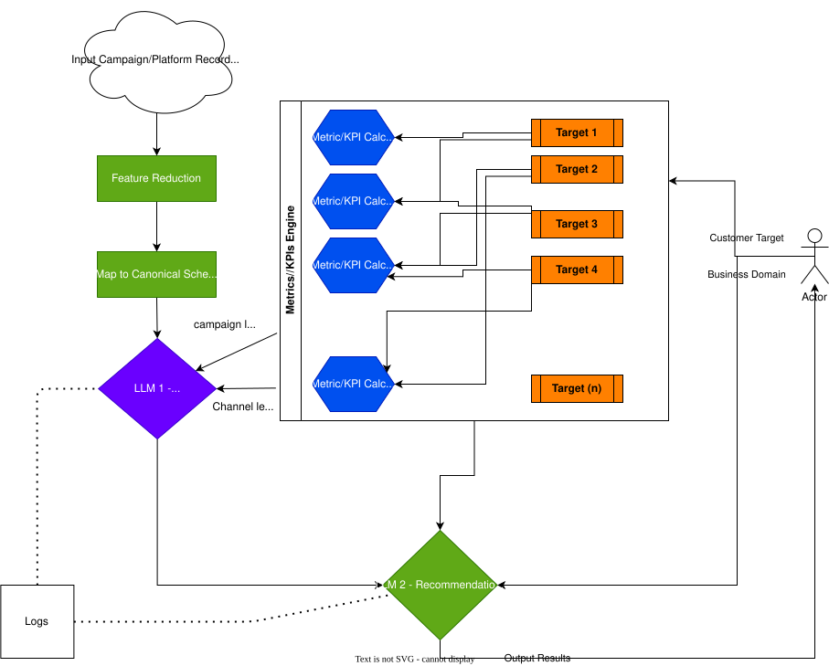

# Team2-MarketingExpert

This is Team 2 Implementation for the Marketing Engine (Making marketing simple for non-marketers. Auto-optimized recommendations in plain
language.)

## Requirements

- Python 3.8 or later

#### Install Python using MiniConda

1) Download and install MiniConda from [here](https://docs.anaconda.com/free/miniconda/#quick-command-line-install)
2) Create a new environment using the following command:
```bash
$ conda create -n market-engine python=3.8
```
3) Activate the environment:
```bash
$ conda activate market-engine
```


## Installation

### Install the required packages

```bash
$ pip install -r requirements.txt
```

### Setup the environment variables

```bash
$ cp .env.example .env
```

Set your environment variables in the `.env` file. Like `OPENAI_API_KEY` value.

## Running the Application

To start the application, run:

```bash
$ streamlit run app.py
```

## Running Unit Tests

To run all unit tests:

```bash
$ pytest tests/
```

To run tests for a specific module:

```bash
$ pytest tests/test_schemas/
$ pytest tests/test_metric_engine/
```

To run tests with verbose output:

```bash
$ pytest tests/ -v
```

To run a specific test file:

```bash
$ pytest tests/test_schemas/test_input_schema.py
```

## Running Evaluation and Aggregation

### Run unified evaluation (analysis + recommendation)

Run from the project root:

```bash
$ python -m src.evaluation.run_evaluation
```

This runs evaluation for all categories by default and writes JSON logs to:

- `evaluation_logs/analysis/`
- `evaluation_logs/recommendation/`

To run for a single category:

```bash
$ python -m src.evaluation.run_evaluation --category "Customer Acquisition"
```

Optional parameters:

```bash
$ python -m src.evaluation.run_evaluation \
	--category "Customer Acquisition" \
	--campaign-id "Spring Launch" \
	--target "Customer Acquisition" \
	--context-rows 20
```

### Aggregate evaluation logs into dashboard CSVs

After running evaluation, aggregate all JSON logs into two overall CSV files:

```bash
$ python -m src.evaluation.run_aggregation_logs
```

Generated files:

- `evaluation_logs/overall/overall_analysis.csv`
- `evaluation_logs/overall/overall_recommendation.csv`

## Pre-commit Hooks

This project uses `pre-commit` to automatically check code quality, formatting, and run tests before committing.

### Installation

First, install pre-commit:

```bash
$ pip install pre-commit
```

Then, activate the pre-commit hook:

```bash
$ pre-commit install
```

### Running Pre-commit

Pre-commit hooks will automatically run on every `git commit`. To manually run all hooks:

```bash
$ pre-commit run --all-files
```

To run a specific hook:

```bash
$ pre-commit run black --all-files
```

### What Pre-commit Checks

- **black** — Auto-formats Python code to ensure consistency
- **isort** — Organizes and sorts Python imports
- **Trailing whitespace** — Removes trailing whitespace
- **File ending** — Ensures files end with newline
- **YAML validation** — Validates YAML syntax
- **JSON validation** — Validates JSON syntax
- **Large files** — Prevents committing files > 1MB
- **Merge conflicts** — Detects merge conflict markers
- **Python AST** — Validates Python syntax
- **pytest** — Runs unit tests

## Workflow Diagram

- Editable source: [docs/diagrams/marketing-expert-workflow.drawio](docs/diagrams/marketing-expert-workflow.drawio)


