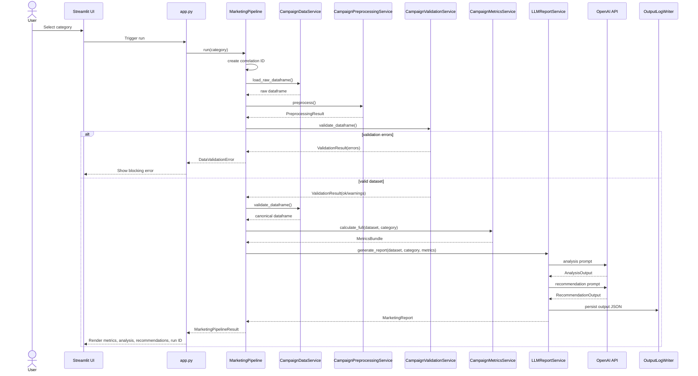
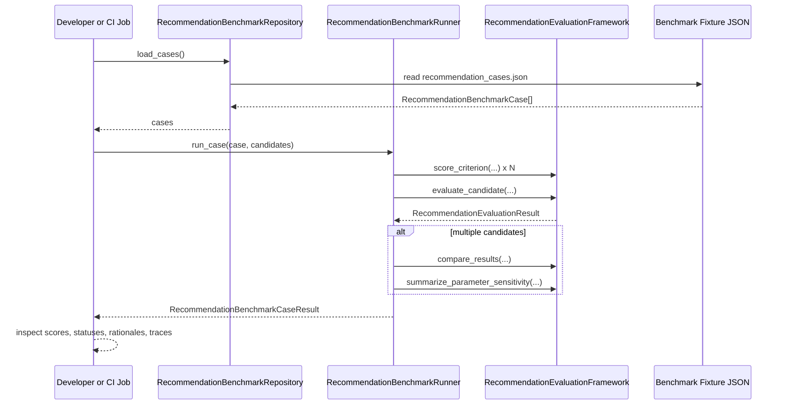

# Team2-MarketingExpert

Team 2 implementation of the Marketing Expert application.

The current version is a modular Streamlit application that loads marketing campaign data, preprocesses and validates it, calculates category-specific metrics, uses an LLM to generate business-facing analysis and recommendations, and supports offline recommendation evaluation through a benchmark-driven scoring framework.

## Table of Contents

- Overview
- Current Version Summary
- End-to-End Application Flow
- Runtime Sequence Diagrams
- Conceptual Design
- Logical Design
- Physical Design
- Package Structure
- Class Catalog
- Important Function-Based Modules
- Architecture Deep Dives
- Configuration
- Installation and Setup
- Running the Application
- Running Tests
- Evaluation Workflow
- Benchmark Command Examples
- Extensibility Notes

## Overview

The application is designed for non-marketing stakeholders who need:

- a simple category-based analysis workflow
- validated and traceable marketing metrics
- structured AI-generated business analysis
- practical recommendation cards with evidence and measurement plans
- repeatable recommendation evaluation outside the main UI flow

The current architecture follows these principles:

- separation of concerns
- practical OOP where orchestration or stable contracts benefit from classes
- pure functions for calculations where classes do not add value
- explicit validation and failure handling
- composable pipeline stages
- traceability through structured logging and correlation IDs

## Current Version Summary

Current application capabilities:

- Streamlit UI for category-driven analysis
- CSV-based data ingestion
- preprocessing for string cleanup, numeric coercion, date normalization, and stable sorting
- explicit validation for required columns, nulls, numeric ranges, funnel consistency, dates, and duplicates
- metric calculation for:
  - Customer Acquisition
  - Customer Satisfaction
  - Revenue Growth
  - Customer Retention
- structured LLM analysis generation
- structured LLM recommendation generation
- output validation for analysis and recommendations
- output persistence to `output_log/`
- benchmark-based recommendation evaluation for offline and CI-style assessment
- structured logging with correlation IDs across the runtime flow

## End-to-End Application Flow

The current user-facing runtime flow is:

1. The user starts the app with `streamlit run app.py`.
2. `app.py` configures logging, loads environment variables, builds `CampaignDataService`, and builds `MarketingPipeline`.
3. The presentation layer in `src/presentation/streamlit_dashboard.py` renders the page header, category buttons, and optional raw-data sidebar.
4. When the user selects a category, `MarketingPipeline.run(...)` starts a new correlation context and assigns a run ID.
5. `CampaignDataService.load_raw_dataframe(...)` loads the CSV from the configured path.
6. `CampaignPreprocessingService.preprocess(...)` normalizes strings, coerces numerics, normalizes dates, and sorts rows.
7. `CampaignValidationService.validate_dataframe(...)` checks explicit failure scenarios such as:
   - missing required columns
   - nulls in required fields
   - negative values
   - clicks greater than impressions
   - conversions greater than clicks
   - invalid rate values
   - invalid dates
   - duplicate rows
8. If validation errors exist, the pipeline stops and raises a `DataValidationError`.
9. If validation passes, `CampaignDataService.validate_dataframe(...)` canonicalizes each row using the `CampaignInput` Pydantic schema.
10. `CampaignMetricsService.calculate_full(...)` calculates overall metrics and per-channel metrics using `MetricCalculatorRegistry` plus the function-based metric calculators.
11. `LLMReportService.generate_report(...)` constructs the shared context block and executes a two-step structured-output LLM flow:
    - analysis generation
    - recommendation generation
12. `ReportValidationService` validates both structured outputs.
13. `OutputLogWriter` saves the final structured result to `output_log/` together with the correlation ID.
14. The pipeline returns a `MarketingPipelineResult` containing raw data, canonical data, preprocessing metadata, validation result, metrics, final report, and the correlation ID.
15. The presentation layer renders:
    - key metrics
    - input validation warnings, if any
    - analysis summary
    - recommendation cards
    - run ID for traceability

The offline recommendation-evaluation flow is separate from the UI flow:

1. Benchmark cases are loaded from `data/benchmarks/recommendation_cases.json`.
2. A `MarketingReport` candidate is wrapped in `RecommendationBenchmarkCandidate`.
3. `RecommendationBenchmarkRunner` scores the candidate against each benchmark case using `RecommendationEvaluationFramework`.
4. The framework returns weighted scores, pass or borderline or fail status, rationale, and trace metadata.
5. Multiple candidates can be ranked and compared consistently, including temperature-sensitivity summaries.

## Runtime Sequence Diagrams

### Interactive Analysis Flow



Static files for environments without Mermaid rendering:

- [Mermaid source](docs/diagrams/interactive_analysis_flow.mmd)
- [Static SVG](docs/diagrams/interactive_analysis_flow.svg)

### Offline Recommendation Evaluation Flow



Static files for environments without Mermaid rendering:

- [Mermaid source](docs/diagrams/offline_recommendation_evaluation_flow.mmd)
- [Static SVG](docs/diagrams/offline_recommendation_evaluation_flow.svg)

## Conceptual Design

### Primary Actors

- Business user: interacts with the Streamlit dashboard and chooses an analysis category.
- Application runtime: coordinates data ingestion, validation, metrics, LLM generation, and presentation.
- OpenAI API: produces structured analysis and recommendation outputs.
- Engineering and QA team: uses the benchmark and evaluation subsystem to compare recommendation quality over time.

### Core Business Concepts

| Concept | Meaning in the system |
| --- | --- |
| Campaign dataset | The raw input marketing data loaded from CSV. |
| Canonical campaign record | A validated row represented by the `CampaignInput` schema. |
| Analysis category | The business question being evaluated, such as acquisition or retention. |
| Metric bundle | The overall and per-channel metric results used for analysis. |
| Analysis output | Structured LLM explanation of what is happening, why, and with what confidence. |
| Recommendation output | Structured recommendation cards containing evidence, actions, expected impact, and measurement plans. |
| Marketing report | The combined business report returned by the AI pipeline. |
| Validation result | Explicit errors and warnings describing data quality and contract issues. |
| Benchmark case | A reusable evaluation scenario with expected problem, evidence, and KPI cues. |
| Evaluation result | Weighted rubric-based assessment of a recommendation output. |

### Core Capabilities

- ingest and normalize heterogeneous campaign data
- validate input quality before business logic runs
- compute stable, testable business metrics
- convert metrics into structured business analysis
- generate actionable recommendations with evidence and measurement plans
- evaluate recommendation quality consistently across versions and parameters

## Logical Design

### Layered View

| Layer | Main Responsibility | Main Modules |
| --- | --- | --- |
| Presentation | UI composition and display logic | `app.py`, `src/presentation/` |
| Orchestration | Coordinates the full application flow | `src/pipelines/` |
| Application Services | Ingestion, preprocessing, validation, metrics, and AI services | `src/ingestion/`, `src/preprocessing/`, `src/validation/`, `src/metrics/`, `src/llm/` |
| Domain Contracts | Stable typed outputs and schemas | `src/reporting/`, `src/schemas/`, `src/metrics/models.py`, `src/validation/models.py` |
| Evaluation | Offline scoring and benchmark comparison | `src/evaluation/` |
| Cross-Cutting | Config, exceptions, observability | `src/config/`, `src/core/` |

### Pipeline Responsibilities

| Pipeline / Step | Responsibility | Primary Classes |
| --- | --- | --- |
| Data ingestion | Read raw data from the configured filesystem path | `CampaignDataService` |
| Preprocessing | Normalize strings, numbers, dates, and row order | `CampaignPreprocessingService`, `PreprocessingResult` |
| Input validation | Detect explicit dataset failure and warning scenarios | `CampaignValidationService`, `ValidationResult`, `ValidationIssue` |
| Canonicalization | Convert rows into a stable schema-backed shape | `CampaignDataService`, `CampaignInput` |
| Metric calculation | Compute overall and per-channel KPIs | `CampaignMetricsService`, `MetricCalculatorRegistry`, `MetricsBundle` |
| AI analysis | Produce a validated analysis object | `LLMReportService`, `ReportValidationService`, `AnalysisOutput` |
| Recommendation generation | Produce validated recommendation cards | `LLMReportService`, `RecommendationOutput`, `RecommendationCard` |
| Report assembly | Combine structured outputs into the app response contract | `MarketingReport` |
| End-to-end orchestration | Execute the full runtime workflow with correlation ID | `MarketingPipeline`, `MarketingPipelineResult` |
| Offline evaluation | Rank recommendation candidates against benchmark cases | `RecommendationEvaluationFramework`, `RecommendationBenchmarkRunner` |

### Integration Boundaries

The major boundaries in the current codebase are:

- UI boundary: `app.py` and `src/presentation/` do not perform business calculations.
- Data boundary: ingestion, preprocessing, and validation are separate from metrics and AI.
- Calculation boundary: metrics are isolated from I/O and UI.
- AI boundary: prompt resolution, API access, validation, and output persistence are isolated in `src/llm/`.
- Evaluation boundary: recommendation scoring is independent of the main UI path.

### Design Notes

- Classes are used where lifecycle coordination, explicit contracts, or stable extension points matter.
- Metric formulas remain function-based in `src/metrics/calculators.py` because pure functions are the simplest and most testable fit for that logic.
- `src/metrics_engine/` remains as a legacy compatibility layer for older imports.

## Physical Design

### Runtime Topology

The current application is a local process architecture:

- one Streamlit frontend process
- one Python application runtime
- local filesystem for data, prompts, logs, and benchmark fixtures
- outbound HTTPS calls to the OpenAI API when generating analysis and recommendations

### Filesystem Layout

| Path | Purpose |
| --- | --- |
| `app.py` | Streamlit entrypoint |
| `src/` | Application source code |
| `data/all_campaigns_data.csv` | Default campaign dataset |
| `data/benchmarks/recommendation_cases.json` | Benchmark fixture cases for recommendation evaluation |
| `prompts/` | Prompt templates used by the LLM service |
| `output_log/` | Saved pipeline outputs with correlation IDs |
| `tests/` | Unit and service-level test suite |
| `docs/` | Architecture and evaluation design documentation |

### External Dependencies

| Dependency | Purpose |
| --- | --- |
| `streamlit` | User interface |
| `pandas` | Data loading and manipulation |
| `pydantic` | Input and output contracts |
| `openai` | Structured LLM analysis and recommendation generation |
| `python-dotenv` | Local environment-variable loading |
| `pytest` | Automated testing |

### Deployment Assumptions

The current physical design assumes:

- local or workstation-based execution
- filesystem access to the configured data and prompt files
- access to an OpenAI API key through environment variables
- no separate database, queue, or background worker in the current version

### Observability and Traceability

The current physical design includes:

- structured application logging through the root Python logger
- correlation IDs per pipeline run
- persisted output JSON files in `output_log/`
- evaluation traces embedded into recommendation evaluation results

## Package Structure

```text
.
|-- app.py
|-- data/
|   |-- all_campaigns_data.csv
|   `-- benchmarks/
|       `-- recommendation_cases.json
|-- docs/
|   |-- index.md
|   |-- application_services_layer.md
|   |-- architecture_refactoring_plan.md
|   |-- cross_cutting_concerns.md
|   |-- diagrams/
|   |   |-- interactive_analysis_flow.mmd
|   |   |-- interactive_analysis_flow.svg
|   |   |-- offline_recommendation_evaluation_flow.mmd
|   |   `-- offline_recommendation_evaluation_flow.svg
|   |-- domain_contracts_layer.md
|   |-- evaluation_layer.md
|   |-- orchestration_layer.md
|   |-- presentation_layer.md
|   `-- recommendation_evaluation_framework.md
|-- scripts/
|   `-- run_recommendation_benchmarks.py
|-- prompts/
|-- src/
|   |-- config/
|   |-- core/
|   |-- evaluation/
|   |-- ingestion/
|   |-- llm/
|   |-- metrics/
|   |-- metrics_engine/
|   |-- pipelines/
|   |-- preprocessing/
|   |-- presentation/
|   |-- reporting/
|   |-- schemas/
|   `-- validation/
|-- tests/
|-- requirements.txt
`-- requirements-dev.txt
```

## Class Catalog

This catalog covers the current application classes under `src/`.

### `src/config`

| Class | Responsibility |
| --- | --- |
| `PathSettings` | Stores resolved filesystem paths for the repo root, dataset, benchmark fixtures, prompt directory, and output log directory. |
| `LLMSettings` | Stores model and temperature configuration for analysis and recommendation generation. |
| `AppSettings` | The top-level immutable configuration object used across services. |

### `src/core`

| Class | Responsibility |
| --- | --- |
| `MarketingExpertError` | Base application exception type. |
| `DataLoadError` | Raised when raw data cannot be loaded from the configured source. |
| `DataValidationError` | Raised when input data fails explicit validation or schema canonicalization. |
| `ReportValidationError` | Raised when LLM-generated analysis or recommendations fail contract validation. |
| `CategoryNotSupportedError` | Reserved for unsupported category requests. |
| `PipelineExecutionError` | Reserved for orchestration-level execution failures. |
| `CorrelationIdFilter` | Injects the active correlation ID into log records for traceability. |

### `src/ingestion`

| Class | Responsibility |
| --- | --- |
| `CampaignDataService` | Loads raw CSV data, runs preprocessing and validation, and canonicalizes data using the input schema. |

### `src/preprocessing`

| Class | Responsibility |
| --- | --- |
| `PreprocessingResult` | Captures the normalized dataframe plus applied steps and row-count metadata. |
| `CampaignPreprocessingService` | Normalizes strings, coerces numerics, normalizes dates, and sorts rows into a stable order. |

### `src/validation`

| Class | Responsibility |
| --- | --- |
| `ValidationIssue` | Represents one validation error or warning with code, message, field, and optional context. |
| `ValidationResult` | Aggregates validation issues and exposes `errors`, `warnings`, `is_valid`, and `raise_for_errors()`. |
| `CampaignValidationService` | Performs explicit input validation on datasets before schema canonicalization. |
| `ReportValidationService` | Validates analysis and recommendation outputs regardless of whether they arrive as models, dicts, or JSON strings. |

### `src/metrics`

| Class | Responsibility |
| --- | --- |
| `MetricsBundle` | Holds overall and per-channel metric results and serializes them to dictionaries. |
| `MetricCalculatorRegistry` | Maps each business category to its metric calculator function. |
| `CampaignMetricsService` | Calculates overall and per-channel metrics using the registry and base metric functions. |

### `src/llm`

| Class | Responsibility |
| --- | --- |
| `PromptRepository` | Resolves prompt file paths for the active category and prompt type. |
| `OutputLogWriter` | Saves structured pipeline outputs to timestamped JSON files. |
| `LLMReportService` | Executes the two-step structured-output LLM workflow and returns a `MarketingReport`. |

### `src/reporting`

| Class | Responsibility |
| --- | --- |
| `MarketingReport` | Combines the validated `AnalysisOutput` and recommendation cards into the UI and API response contract. |

### `src/pipelines`

| Class | Responsibility |
| --- | --- |
| `MarketingPipelineResult` | Full result object returned by the runtime pipeline, including the correlation ID, raw data, processed data, validation result, metrics, and report. |
| `MarketingPipeline` | Orchestrates the end-to-end application flow and exposes both stage-level methods and full `run(...)`. |

### `src/evaluation`

| Class | Responsibility |
| --- | --- |
| `EvaluationStatus` | Enum representing normalized evaluation states: pass, borderline, and fail. |
| `CriterionDefinition` | Defines a recommendation-evaluation criterion, including thresholds and weight. |
| `CriterionScore` | Stores the score, status, rationale, and evidence for a single criterion. |
| `RecommendationEvaluationResult` | Stores the full scored result for one candidate recommendation output. |
| `ParameterSensitivitySummary` | Summarizes score stability across parameter changes such as temperature. |
| `RecommendationEvaluationFramework` | Applies the scoring rubric, aggregates weighted results, compares candidates, and summarizes sensitivity. |
| `RecommendationBenchmarkCase` | Defines one benchmark fixture case for recommendation evaluation. |
| `RecommendationBenchmarkCandidate` | Wraps a `MarketingReport` candidate and its parameter metadata for evaluation. |
| `RecommendationBenchmarkCaseResult` | Stores ranked evaluation results for one benchmark case. |
| `RecommendationBenchmarkSuiteResult` | Stores the full set of case results for a benchmark suite run. |
| `RecommendationBenchmarkRepository` | Loads benchmark cases from the JSON fixture file. |
| `RecommendationBenchmarkRunner` | Scores, ranks, and compares recommendation outputs against benchmark cases. |

### `src/schemas`

| Class | Responsibility |
| --- | --- |
| `CampaignInput` | Canonical input schema for one campaign data row after preprocessing. |
| `AnalysisOutput` | Structured schema for the LLM analysis step. |
| `RecommendationActionStep` | One actionable recommendation step with location, method, and guardrails. |
| `ExpectedImpact` | Expected business effect of a recommendation. |
| `MeasurementPlan` | How the recommendation should be measured and judged. |
| `RecommendationCard` | One full recommendation card shown in the UI and persisted in output logs. |
| `RecommendationOutput` | Root schema containing the list of recommendation cards. |

## Important Function-Based Modules

Some of the most important logic in the system intentionally remains function-based.

### `src/metrics/calculators.py`

This module contains the metric formulas as pure functions:

- `calculate_base_metrics`
- `calculate_acquisition_metrics`
- `calculate_satisfaction_metrics`
- `calculate_revenue_metrics`
- `calculate_retention_metrics`

These remain functions because they are stateless, deterministic, and easier to test in isolation than equivalent class wrappers.

### `src/llm/client.py`

This module exposes the OpenAI client integration functions:

- `get_client`
- `chat_completion`

### `src/llm/prompts.py`

This module contains prompt-loading and prompt-construction functions used by `LLMReportService`.

### `src/presentation/streamlit_dashboard.py`

The presentation module remains function-based because Streamlit rendering is most readable as a set of stateless view helpers.

### Legacy Compatibility Layer

`src/metrics_engine/` still exists as a compatibility package for earlier imports. It delegates to the refactored metrics and ingestion services.

## Architecture Deep Dives

The README is the consolidated high-level reference. The following documents go deeper by layer.

- [Documentation Index](docs/index.md)
- [Presentation Layer](docs/presentation_layer.md)
- [Orchestration Layer](docs/orchestration_layer.md)
- [Application Services Layer](docs/application_services_layer.md)
- [Domain Contracts Layer](docs/domain_contracts_layer.md)
- [Evaluation Layer](docs/evaluation_layer.md)
- [Cross-Cutting Concerns](docs/cross_cutting_concerns.md)
- [Architecture Refactoring Plan](docs/architecture_refactoring_plan.md)
- [Recommendation Evaluation Framework](docs/recommendation_evaluation_framework.md)

## Configuration

The current version supports configuration through environment variables.

| Variable | Purpose | Default |
| --- | --- | --- |
| `OPENAI_API_KEY` | OpenAI API key used by the LLM service | Required for AI generation |
| `OPENAI_ANALYSIS_MODEL` | Model used for the analysis step | `gpt-4o-mini` |
| `OPENAI_RECOMMENDATION_MODEL` | Model used for the recommendation step | `gpt-4o-mini` |
| `OPENAI_ANALYSIS_TEMPERATURE` | Temperature for the analysis step | `0.2` |
| `OPENAI_RECOMMENDATION_TEMPERATURE` | Temperature for the recommendation step | `0.2` |
| `MARKETING_DATA_FILE` | Dataset path | `data/all_campaigns_data.csv` |
| `MARKETING_RECOMMENDATION_BENCHMARK_FILE` | Benchmark fixture path | `data/benchmarks/recommendation_cases.json` |
| `MARKETING_PROMPT_DIR` | Prompt directory path | `prompts/` |
| `MARKETING_OUTPUT_LOG_DIR` | Output log directory | `output_log/` |

## Installation and Setup

### Requirements

- Python 3.10 or later is recommended for the current codebase.
- OpenAI API access is required for the live AI analysis flow.

### Create and activate an environment

```bash
python -m venv .venv
.venv\Scripts\activate
```

### Install runtime dependencies

```bash
pip install -r requirements.txt
```

### Install development dependencies

```bash
pip install -r requirements-dev.txt
```

### Configure environment variables

Create a `.env` file in the repository root and provide at least:

```env
OPENAI_API_KEY=your_api_key_here
```

Optional overrides can be added for model choice, temperatures, input file, benchmark file, prompt directory, and output directory.

## Running the Application

Start the Streamlit app:

```bash
streamlit run app.py
```

What the user will see in the current version:

- category buttons for four business areas
- optional sidebar raw data preview
- key metric cards
- validation warnings if present
- structured analysis summary
- structured recommendation cards
- correlation-based run ID

## Running Tests

Run the full automated test suite:

```bash
python -m pytest
```

The current automated suite covers:

- schema validation
- preprocessing behavior
- input validation behavior
- metric calculation services
- pipeline orchestration
- observability correlation helpers
- recommendation evaluation framework
- benchmark runner behavior

## Evaluation Workflow

The evaluation subsystem is designed for offline assessment, regression checks, and CI use.

Current evaluation assets:

- rubric framework: `src/evaluation/recommendation_framework.py`
- benchmark runner: `src/evaluation/benchmarks.py`
- starter benchmark fixtures: `data/benchmarks/recommendation_cases.json`
- saved pipeline outputs now include `parameter_settings` with model, temperature, prompt paths, and prompt hashes

The current evaluation process is:

1. load benchmark cases from the repository
2. build one or more `RecommendationBenchmarkCandidate` objects from `MarketingReport` outputs
3. run the candidates through `RecommendationBenchmarkRunner`
4. inspect ranked results, criterion-level rationales, and sensitivity summaries

This path is intentionally separate from the main Streamlit flow so evaluation can run in local tooling, scripts, or CI without requiring UI interaction.

## Benchmark Command Examples

### Quick one-line commands

List cases:

```bash
python scripts/run_recommendation_benchmarks.py --list-cases
```

Evaluate a built-in sample candidate:

```bash
python scripts/run_recommendation_benchmarks.py --sample-report --case retention-risk-001
```

Evaluate the latest saved app output:

```bash
python scripts/run_recommendation_benchmarks.py --latest-output
```

The `--latest-output` and `--report-json` modes automatically reuse the `parameter_settings` captured in `output_log/` files, so model and prompt revisions travel with each saved run.

Save benchmark results to a JSON file:

```bash
python scripts/run_recommendation_benchmarks.py --latest-output --output output_log/benchmark_results.json
```

### List available benchmark cases

PowerShell example:

```powershell
 @'
from src.evaluation import RecommendationBenchmarkRepository

for case in RecommendationBenchmarkRepository().load_cases():
    print(f"{case.case_id}: {case.category} -> {case.description}")
 '@ | python -
```

### Run a sample benchmark candidate and print JSON

PowerShell example:

```powershell
 @'
import json
from src.evaluation import RecommendationBenchmarkCandidate, RecommendationBenchmarkRepository, RecommendationBenchmarkRunner
from src.reporting import MarketingReport
from src.schemas.analysis_output_schema import AnalysisOutput
from src.schemas.recommendation_output_schema import ExpectedImpact, MeasurementPlan, RecommendationActionStep, RecommendationCard


def card(title: str) -> RecommendationCard:
    return RecommendationCard(
        id=title.upper().replace(" ", "-"),
        title=title,
        category="Customer Retention",
        priority="High",
        effort="Medium",
        time_to_see_impact="2 weeks",
        confidence="High",
        whats_happening="Customer retention is weakening and churn is rising.",
        evidence=["Churn rate increased and retention rate declined."],
        what_you_should_do=[
            RecommendationActionStep(
                step="Launch a segmented follow-up campaign",
                where="CRM",
                how="Target churn-risk customers with a win-back and onboarding sequence.",
                guardrails=["Avoid spamming recent purchasers."],
            )
        ],
        why_this_matters="It protects repeat revenue.",
        expected_impact=ExpectedImpact(
            primary_kpi="Retention rate",
            direction="Increase",
            explanation="At-risk customers receive timely intervention.",
        ),
        dependency_or_risk=["Needs lifecycle operations support."],
        measurement_plan=MeasurementPlan(
            how_to_measure="Compare retention before and after the campaign.",
            success_criteria="Retention rate improves by 5%.",
            check_timing="2 weeks",
            notes="Monitor by segment.",
        ),
        owner_suggestion="Lifecycle team",
    )

report = MarketingReport(
    category="Customer Retention",
    analysis=AnalysisOutput(
        analysis="Retention has softened and churn is rising.",
        key_signals=["Retention rate fell week over week."],
        detected_issues=["Churn increased among newer customers."],
        root_cause_hypothesis="The onboarding and follow-up journey is not engaging customers quickly enough.",
        business_risks=["Repeat revenue may decline."],
        confidence_score=80.0,
    ),
    recommendations=(
        card("Launch segmented follow-up campaign"),
        card("Improve onboarding win-back flow"),
        card("Refine churn-risk segment targeting"),
        card("Test retention offer timing"),
        card("Strengthen post-purchase follow-up"),
    ),
)

case = RecommendationBenchmarkRepository().load_cases()[1]
result = RecommendationBenchmarkRunner().run_case(
    case,
    [
        RecommendationBenchmarkCandidate(
            candidate_id="retention-temp-0.2",
            report=report,
            parameter_settings={"temperature": 0.2},
        )
    ],
)
print(json.dumps(result.to_dict(), indent=2))
 '@ | python -
```

### Sample benchmark output JSON

The following example was generated from the current codebase and trimmed slightly for readability:

```json
{
  "case_id": "retention-risk-001",
  "category": "Customer Retention",
  "ranked_results": [
    {
      "candidate_id": "retention-temp-0.2",
      "overall_score": 4.88,
      "overall_status": "pass",
      "parameter_settings": {
        "temperature": 0.2
      },
      "criteria": [
        {
          "name": "problem_relevance",
          "score": 5.0,
          "status": "pass",
          "rationale": "Problem-term coverage=1.00; forbidden_hits=0; report_category=Customer Retention",
          "evidence": ["retention", "churn", "repeat", "customer"]
        },
        {
          "name": "evidence_grounding",
          "score": 5.0,
          "status": "pass",
          "rationale": "Evidence ratio=1.00; expected evidence term coverage=0.67",
          "evidence": ["churn", "retention"]
        }
      ],
      "trace": {
        "benchmark_case_id": "retention-risk-001",
        "benchmark_category": "Customer Retention",
        "correlation_id": "-",
        "hard_failures_present": false,
        "missing_criteria": []
      }
    }
  ],
  "sensitivity_summary": null
}
```

Interpretation notes:

- `overall_score` is the weighted aggregate of all criterion scores.
- `overall_status` is derived from aggregate score plus hard-fail rules.
- `parameter_settings` is where model settings such as temperature should be recorded for comparison.
- `trace` exists to explain why a score belongs to a specific case and runtime context.
- `correlation_id` is `-` in this example because the benchmark run was executed outside the main pipeline correlation context.

## Extensibility Notes

The current design is prepared for future growth in these areas:

- additional preprocessing steps without changing the public pipeline contract
- additional metric categories through `MetricCalculatorRegistry`
- additional prompt variants and models through `AppSettings` and `LLMSettings`
- API or batch entrypoints reusing `MarketingPipeline`
- benchmark-suite expansion for additional categories and adversarial cases
- more advanced logging sinks or telemetry backends using the existing correlation-ID mechanism

The codebase intentionally avoids unnecessary abstraction. New classes should be added only when they improve coordination, testability, or boundary clarity. Stateless calculations and prompt-building helpers should continue to stay function-based unless a stronger reason emerges.
