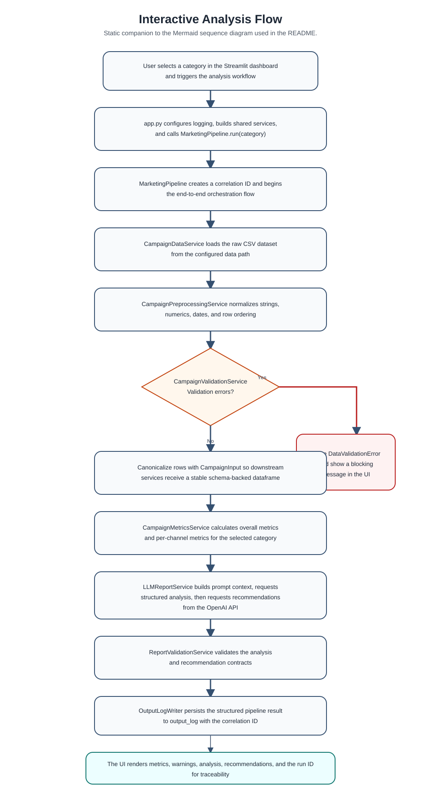
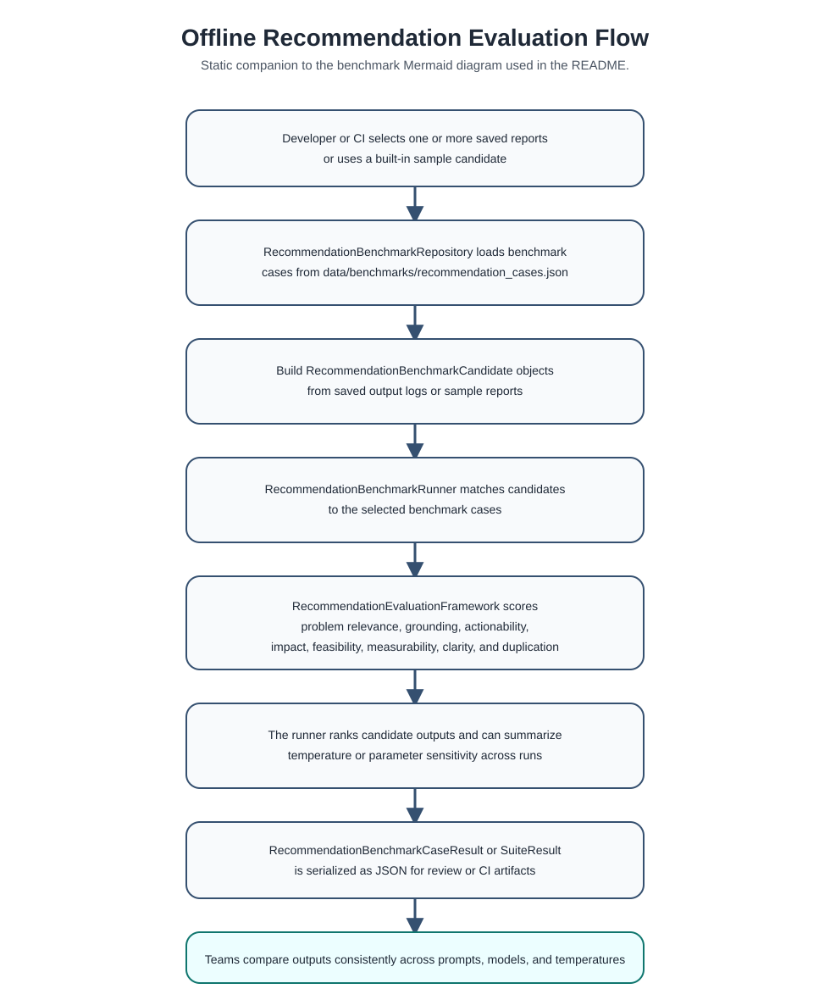

# Documentation Index

This page is the central navigation point for the current Marketing Expert documentation set.

## Start Here

- [Project README](../README.md)
- [Architecture Refactoring Plan](architecture_refactoring_plan.md)
- [Recommendation Evaluation Framework](recommendation_evaluation_framework.md)

## Architecture by Layer

- [Presentation Layer](presentation_layer.md)
- [Orchestration Layer](orchestration_layer.md)
- [Application Services Layer](application_services_layer.md)
- [Domain Contracts Layer](domain_contracts_layer.md)
- [Evaluation Layer](evaluation_layer.md)
- [Cross-Cutting Concerns](cross_cutting_concerns.md)

## Static Diagrams

The README keeps the Mermaid source inline. This folder also stores static SVG companions for viewers that do not render Mermaid.

### Interactive Analysis Flow

- [Mermaid Source](diagrams/interactive_analysis_flow.mmd)
- [Static SVG](diagrams/interactive_analysis_flow.svg)

### Offline Recommendation Evaluation Flow

- [Mermaid Source](diagrams/offline_recommendation_evaluation_flow.mmd)
- [Static SVG](diagrams/offline_recommendation_evaluation_flow.svg)

## Benchmark Tooling

The repository now includes a runnable helper script for benchmark workflows.

Quick commands:

- `python scripts/run_recommendation_benchmarks.py --list-cases`
- `python scripts/run_recommendation_benchmarks.py --sample-report --case retention-risk-001`
- `python scripts/run_recommendation_benchmarks.py --latest-output`
- `python scripts/run_recommendation_benchmarks.py --report-json output_log\\pipeline_output_20260331_120000.json`

Use `python scripts/run_recommendation_benchmarks.py --help` to see the full CLI options.

Saved pipeline outputs now carry `parameter_settings` automatically, including model names, temperatures, prompt source paths, and prompt hashes. The benchmark script reuses that metadata when it evaluates saved outputs.
