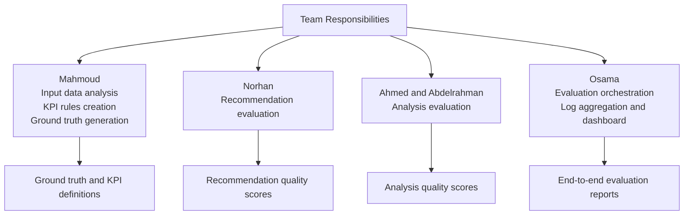

# Team Responsibilities (Brief Diagram)

```mermaid
flowchart TB
    T[Team Responsibilities]

    M[Mahmoud<br/>Input data analysis<br/>KPI rules creation<br/>Ground truth generation]
    N[Norhan<br/>Recommendation evaluation]
    A[Ahmed and Abdelrahman<br/>Analysis evaluation]
    O[Osama<br/>Evaluation orchestration<br/>Log aggregation and dashboard]

    T --> M
    T --> N
    T --> A
    T --> O

    M --> X[Ground truth and KPI definitions]
    N --> Y[Recommendation quality scores]
    A --> Z[Analysis quality scores]
    O --> W[End-to-end evaluation reports]
```
