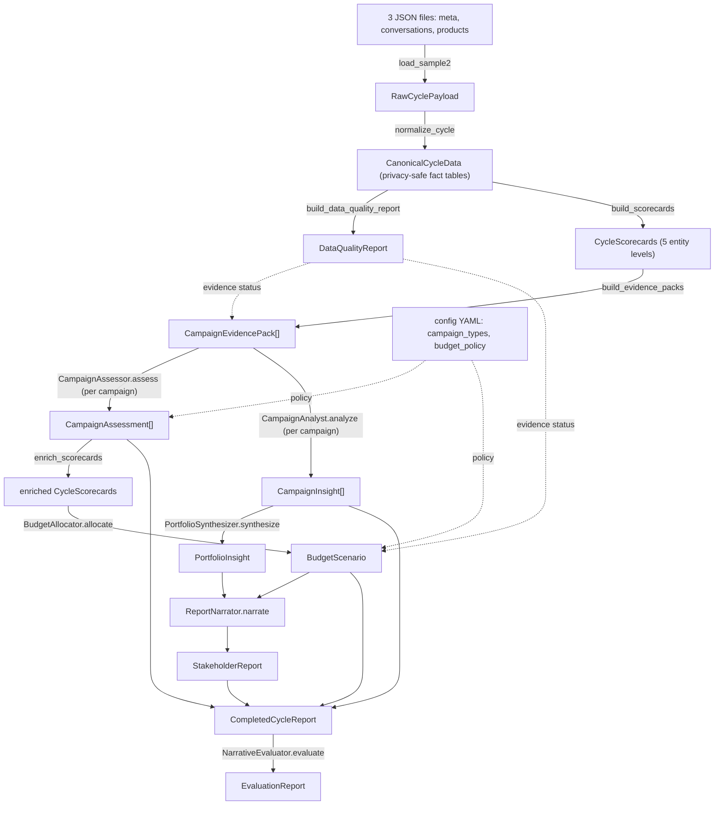
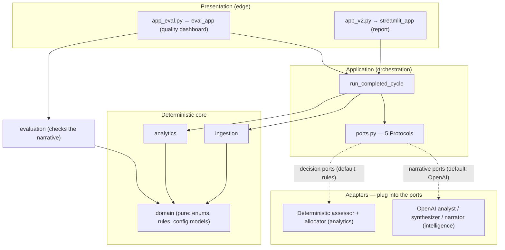
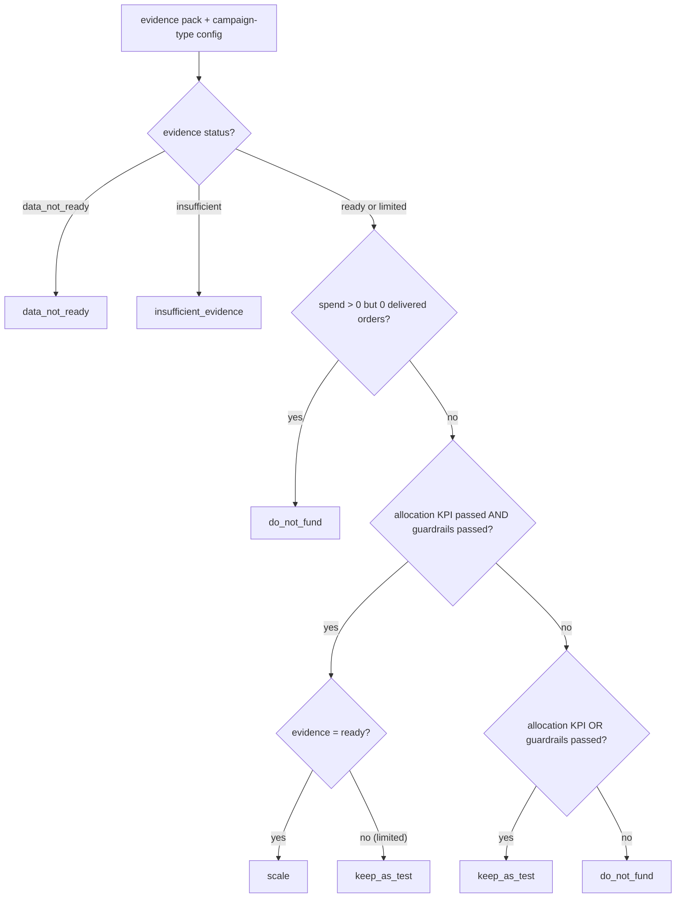
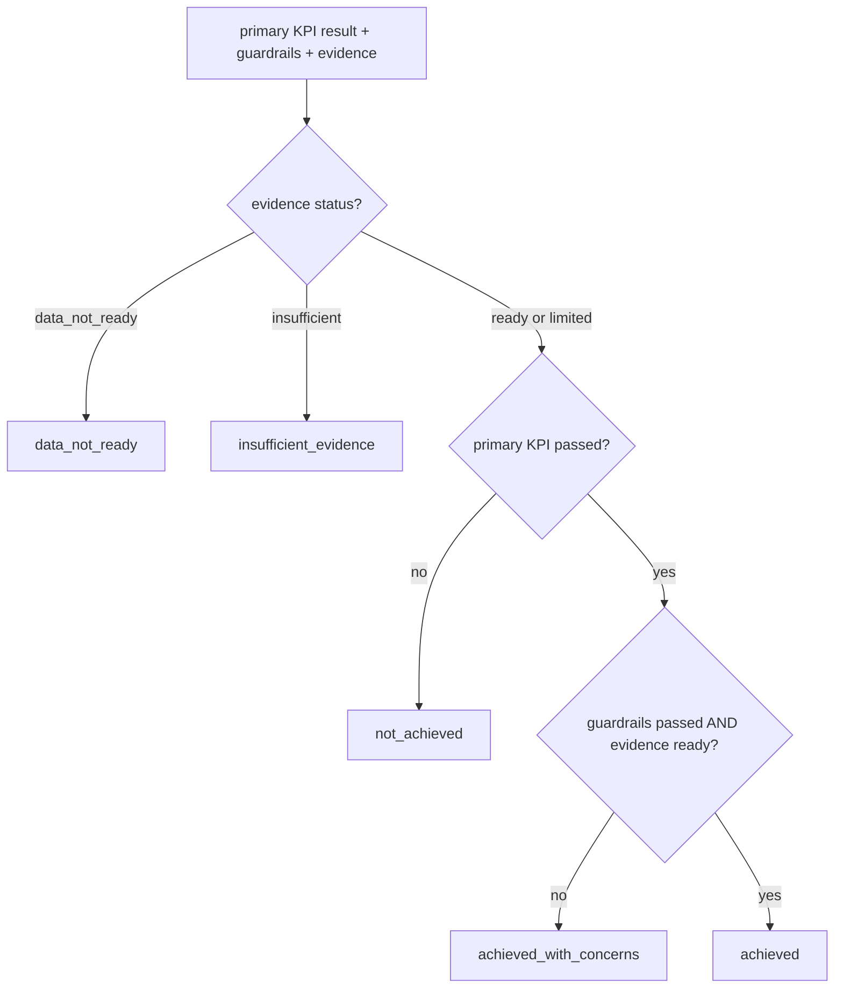
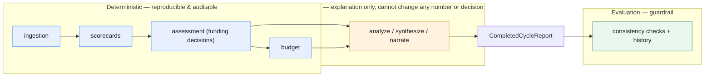

# `src_2` — Architecture Diagrams

Reflects the current code (post-cleanup: 5 ports, deterministic decisions, LLM-only
narrative, evaluation layer). Diagrams are **Mermaid** — they render directly in
GitHub and VS Code, and stay diffable in version control.

Contents:
1. [Pipeline (data-flow)](#1-pipeline--data-flow) — the workflow
2. [Hexagonal architecture (ports & adapters)](#2-hexagonal-architecture--ports--adapters) — the structure
3. [Decision rules](#3-decision-rules) — how a campaign's next action is chosen
4. [Trust boundary](#4-trust-boundary--deterministic-vs-ai) — deterministic vs AI

---

## 1. Pipeline / data-flow

What one call to `run_completed_cycle` does. Edge labels are the functions/ports;
node labels are the **contracts** passed between stages.

**Read it as:** deterministic measurement (top) → decision ports → deterministic
enrichment → narrative ports → assembled report → evaluation.

---

## 2. Hexagonal architecture / ports & adapters

Dependencies point **inward** (edge → application → core → domain). The five ports
are the swappable sockets; adapters implement them.

**The 5 ports:** `CampaignAssessor`, `BudgetAllocator` (decision — default
deterministic), `CampaignAnalyst`, `PortfolioSynthesizer`, `ReportNarrator`
(narrative — default OpenAI).

---

## 3. Decision rules

The transparent logic inside `DeterministicCampaignAssessor`
(`domain/assessment_rules.py`). No weighted scores — a sequence of explicit gates.

### 3a. Next-cycle action

### 3b. Target status (did it do its job?)

**Then, parent → child propagation** (`_add_child_decisions`): an adset/ad/creative
can never override a blocked parent — if the campaign is `do_not_fund` /
`data_not_ready`, its children inherit that; otherwise children are judged on their
own within-campaign benchmark and minimum-evidence thresholds.

---

## 4. Trust boundary — deterministic vs AI

The golden rule made visual: rules compute and decide (auditable, reproducible); the
AI only explains; the evaluator watches the AI.

---

### Keeping these accurate
These are hand-maintained. If you change the pipeline order, a port, or a decision
rule, update the matching diagram. The decision rules (§3) mirror
`domain/assessment_rules.py` exactly; the pipeline (§1) mirrors
`application/reporting.py`.
